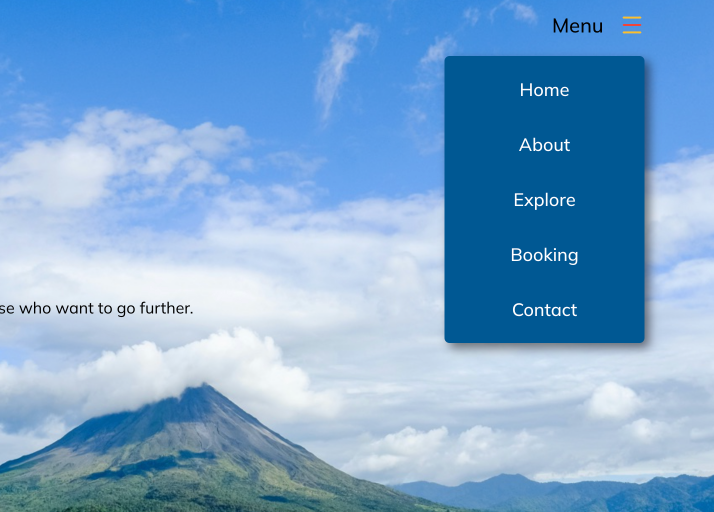
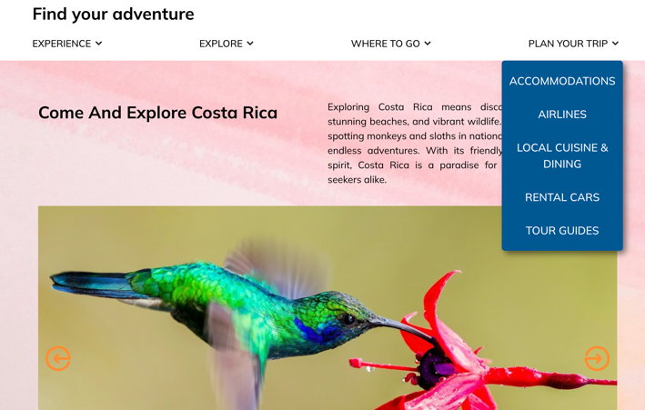
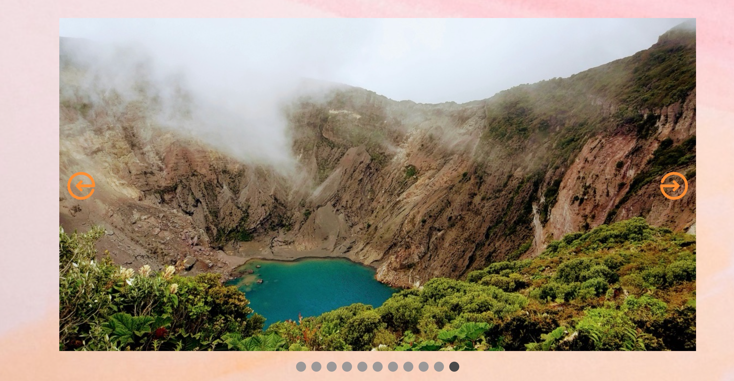

# The Odin Project practice for Dropdown Menu and Carousel

## Table of contents
- [The Odin Project practice for Dropdown Menu and Carousel](#the-odin-project-practice-for-dropdown-menu-and-carousel)
  - [Table of contents](#table-of-contents)
  - [Overview](#overview)
      - [Dropdown Menu](#dropdown-menu)
      - [Carousel](#carousel)
    - [Screenshots](#screenshots)
    - [Links](#links)
  - [Credits](#credits)
    - [Icons](#icons)
    - [Images](#images)

## Overview

#### Dropdown Menu

This is a practice for dropdown menu using JavaScript and CSS. It is a part of the assignment for The Odin Project. When user clicks the button, it toggles the dropdown menu. JavaScript code is reusable so that it can be used in other projects.

#### Carousel

The photo gallery is in the form of a slideshow with buttons to go to the previous and next slides.  It also has a dot navigation - by clicking a specific dot, user can go to the specific slide. Also the carousel will automatically go to the next slide every 5 seconds.

### Screenshots

### Links

- Solution URL: [https://github.com/py-code314/dropdown-carousel](https://github.com/py-code314/dropdown-carousel)
- Github Pages URL: [https://py-code314.github.io/dropdown-carousel/](https://py-code314.github.io/dropdown-carousel/)

## Credits

### Icons
All icons are from [Reshot](https://www.reshot.com/) and [Icomoon](https://icomoon.io/app/#/select)

### Images
1. Volcano (image-mountain.jpeg) - "Costa Rica Volcano" by Fabio Fistarol on [Unsplash](https://unsplash.com/photos/green-mountain-under-blue-sky-and-white-clouds-during-daytime-AL8LzIpl7YI)
   
2. Toucan - "Keel-billed Toucan" by Zdeněk Macháček on [Unsplash](https://unsplash.com/photos/black-and-yellow-bird-standing-on-tree-branch-XUFMiGkv-60)
   
3. Hanging Bridge - "
Man walking over a bridge in a cloud forest near La Fortuna, Costa Rica" by Selina Bubendorfer on [Unsplash](https://unsplash.com/photos/person-in-yellow-jacket-standing-on-hanging-bridge-X3zFdLVQLKE)

4. Kayaking - "Drake Bay Kayak" by Filip Mroz on [Unsplash](https://unsplash.com/photos/woman-on-kayak-on-body-of-water-holding-paddle-zK049OFP4uI)
   
5. Coffee Beans - "person holding coffee beans on stainless steel faucet, Coffee" by David Regueira on [Unsplash](https://unsplash.com/photos/person-holding-coffee-beans-on-stainless-steel-faucet-iZ0FVcET6-I)
   
6. Humming Bird - "green and black humming bird flying" by Zdeněk Macháček on [Unsplash](https://unsplash.com/photos/green-and-black-humming-bird-flying-p-DDK9lOmmE)
   
7. Sloth - "a sloth hanging from a tree branch in a forest" by Bennet Robin Fabian on [Unsplash](https://unsplash.com/photos/a-sloth-hanging-from-a-tree-branch-in-a-forest--di56twomhU)
   
8. Monkey - "a white and black monkey sitting on a tree branch" by Sebastián Silva Solar on [Unsplash](https://unsplash.com/photos/a-white-and-black-monkey-sitting-on-a-tree-branch-dRovLqA5mVY)
   
9.  Beach - "Sunset in Costa Rica" by Adrian Eriksson on [Unsplash](https://unsplash.com/photos/people-on-beach-during-sunset-kysT00dgrpI)
    
10. Parrot - "blue yellow and red parrot" by Zdeněk Macháček on [Unsplash](https://unsplash.com/photos/blue-yellow-and-red-parrot-46tBp3bP8LQ)
    
11. Lake - "lake at the center of mountain at daytime" by Alex Ip on [Unsplash](https://unsplash.com/photos/lake-at-the-center-of-mountain-at-daytime-wFNNzXgo0Do)
    
12. Red Eyed Frog - "selective photography of red-eyed tree frog" by Stephanie LeBlanc on [Unsplash](https://unsplash.com/photos/selective-photography-of-red-eyed-tree-frog-JLMEZxBcXCU)
    
13. Watercolor Paper - "pink and orange paints" by Annie Spratt on [Unsplash](https://unsplash.com/photos/pink-and-orange-paints-zA7I5BtFbvw)
